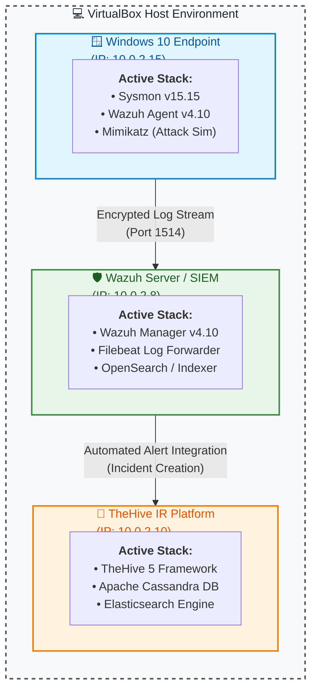

# Autonomous Home SOC & Automated Security Incident Response Lab
**CYB-475 Cybersecurity Senior Capstone Project** | Utica University[cite: 2]
**Author:** Mohamed Alhyawah[cite: 2]

---

## 📌 Project Overview
This project documents the design, implementation, and operational testing of an enterprise-grade, zero-cost Security Operations Center (SOC) home lab[cite: 2]. By leveraging open-source security software and virtualized network topologies, this lab simulates real-world threat detection, log telemetry ingestion, and automated incident response workflows[cite: 2].

### Key Technical Achievements
* **Full-Stack SIEM & XDR:** Deployed Wazuh Manager on Ubuntu 22.04 LTS for centralized log analysis and alerting[cite: 2].
* **Endpoint Telemetry Enrichment:** Configured Sysmon on Windows 10 endpoints using Olaf Hartong’s `sysmon-modular` configuration to capture process execution, network connections, and credential access events[cite: 2].
* **Automated Incident Response (SOAR):** Integrated TheHive 5 framework backed by Apache Cassandra and Elasticsearch for centralized case management and automated alert triage[cite: 2].
* **Adversary Emulation:** Simulated credential dumping attacks using **Mimikatz** to validate detection rules, Sysmon logging pipelines, and SIEM archive ingestion[cite: 2].

---

## 📐 Network Architecture Topology



---

## 🛠️ Technology Stack & Tools

| Component | Tool / Technology | Deployment Context |
| :--- | :--- | :--- |
| **Hypervisor** | Oracle VirtualBox[cite: 2] | Virtual environment hosting all lab nodes[cite: 2] |
| **Endpoint OS** | Windows 10 Pro (22H2)[cite: 2] | Target host configured for telemetry and attack simulation[cite: 2] |
| **SIEM & XDR** | Wazuh Server v4.10[cite: 2] | Centralized log collector, correlation engine, and dashboard[cite: 2] |
| **Telemetry Generator** | Microsoft Sysmon v15.15[cite: 2] | Deep endpoint event logging (`sysmon-modular` config)[cite: 2] |
| **Incident Management**| TheHive 5 + StrangeBee[cite: 2] | Automated alert triage and case creation platform[cite: 2] |
| **Database Engines** | Apache Cassandra & Elasticsearch[cite: 2] | Backend storage and indexing layer for TheHive[cite: 2] |
| **Attack Simulation** | Mimikatz v2.2.0[cite: 2] | Post-exploitation tool used to test LSASS dump detection[cite: 2] |

---

## 🚀 Deployment & Configuration Workflow

### Phase 1: Environment Setup & Agent Deployment
1. Provisioned an Ubuntu 22.04 LTS VM on VirtualBox and installed the single-node Wazuh Manager stack[cite: 2].
2. Deployed a Windows 10 Enterprise VM, installed Microsoft Sysmon, and applied Olaf Hartong's `sysmonconfig.xml` profile via PowerShell[cite: 2]:
   ```powershell
   .\Sysmon64.exe -i sysmonconfig.xml
   ```
3. Enrolled the Windows host into the Wazuh Manager using the remote agent installer and verified active connection status in the SIEM dashboard[cite: 2].

### Phase 2: Telemetry Ingestion & Filebeat Archives
1. Modified `ossec.conf` on the Windows agent to read Sysmon operational logs[cite: 2]:
   ```xml
   <localfile>
     <location>Microsoft-Windows-Sysmon/Operational</location>
     <log_format>eventchannel</log_format>
   </localfile>
   ```
2. Configured `ossec.conf` and `/etc/filebeat/filebeat.yml` on the Wazuh Manager to log and archive all raw events (`<logall_json>yes</logall_json>`)[cite: 2].
3. Created custom `wazuh-archives-*` index patterns within OpenSearch/Wazuh Dashboard to enable deep historical log querying[cite: 2].

### Phase 3: TheHive SOAR Integration
1. Deployed a dedicated Ubuntu 22.04 VM for TheHive 5[cite: 2].
2. Configured `/etc/cassandra/cassandra.yaml` and `/etc/elasticsearch/elasticsearch.yml` listening interfaces to `10.0.2.10`[cite: 2].
3. Linked Wazuh to TheHive via webhook integrators to automatically parse high-severity alerts into actionable security incidents[cite: 2].

---

## ⚡ Attack Simulation & Detection Validation

To validate detection efficacy, a credential access attack was simulated on the Windows 10 endpoint using **Mimikatz**[cite: 2]:

1. **Execution:** Configured Microsoft Defender exclusions on the target host to permit execution, then executed `mimikatz.exe` via PowerShell[cite: 2].
2. **Detection:** Sysmon captured process creation and LSASS handle access events[cite: 2].
3. **SIEM Telemetry:** Wazuh processed event streams and generated active alerts matching process creation metadata (`originalFileName: mimikatz.exe`)[cite: 2].
4. **SOAR Triage:** High-severity alerts were ingested into TheHive dashboard as incident cases for analyst remediation[cite: 2].

---

## 📜 References
* Alhyawah, M. (2025). *Building a Free SOC Lab at Home: A Practical Guide for Aspiring Cybersecurity Professionals*. Utica University Capstone Project[cite: 2].
* Wazuh Documentation & Integration Guides[cite: 2].
